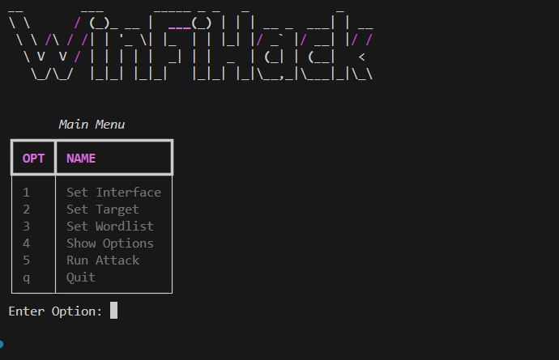

# WinFiHack

```bash
__        ___       _____ _ _   _            _
\ \      / (_)_ __ |  ___(_) | | | __ _  ___| | __
 \ \ /\ / /| | '_ \| |_  | | |_| |/ _` |/ __| |/ /
  \ V  V / | | | | |  _| | |  _  | (_| | (__|   <
   \_/\_/  |_|_| |_|_|   |_|_| |_|\__,_|\___|_|\_\
```

WinFiHack 是我对之前项目 [Brute-Hacking-Framework](https://github.com/morpheuslord/Brute-Hacking-Framework-SourceCode) 的主 WiFi 破解脚本的重新编写。这个脚本使用 netsh 和原生 Windows 脚本来创建一个 WiFi 暴力破解工具。它不是一个快速的脚本，也不是做相同破解的最佳方式，但它不需要外部库，只需 Python 和 Python 脚本即可。

## 安装

所需的包非常少或几乎没有 😅。安装命令如下：

```bash
pip install rich pyfiglet
```

就这么简单。

## 特性

列出功能如下：

- _总体功能：_
  - 可以使用自定义接口或非默认接口来进行攻击。
  - 使用 netsh 和列出、利用目标的方式清晰明了。
  - 可升级性

- _代码功能：_
  - 使用 `rich` 的交互式菜单系统。
  - 在接口、目标和密码文件使用上的多样性。

## 工作原理

暴力破解工具的工作原理如下：


- _提供接口：_

  - 用户需要提供工具使用的网络接口。
  - 默认情况下，接口设置为 `Wi-Fi`。

- _搜索和设置目标：_

  - 用户必须搜索并选择目标网络。
  - 在此过程中，工具执行以下子步骤：
    - 断开选定接口的所有活动网络连接。
    - 搜索范围内的所有可用网络。

- _输入密码文件：_

  - 用户输入密码文件的路径。
  - 默认密码文件路径为 `./wordlist/default.txt`。

- _运行攻击：_

  - 在设置了目标和准备好密码文件后，工具准备启动攻击。

- _攻击过程：_
  - 攻击过程涉及遍历提供文件中的每个密码。
  - 对于每个密码，执行以下步骤：
    - 生成并存储用于连接尝试的自定义 XML 配置。
    - 使用生成的 XML 和当前密码尝试连接到目标网络。
    - 为验证连接尝试的成功性，工具执行对 Google 的“1包 ping”。
    - 如果 ping 不成功，则连接尝试被视为失败，工具将继续下一个密码。
    - 这个循环会一直进行，直到收到成功的 ping 响应，表示连接尝试成功。

## 如何运行

在安装完所有包后，只需运行 `python main.py`，其余的就是历史了 👍 请确保在 Windows 上运行，因为它在其他操作系统上无法工作。界面如下：


## 贡献

有关贡献：

- *首先克隆：* 首先将代码库克隆到你的开发环境中并进行编辑。
- *评论：* 我会很感激如果你能添加评论，解释你的观点和升级内容。
- *提交：* 提交 PR 让我验证更改并在必要时批准。
